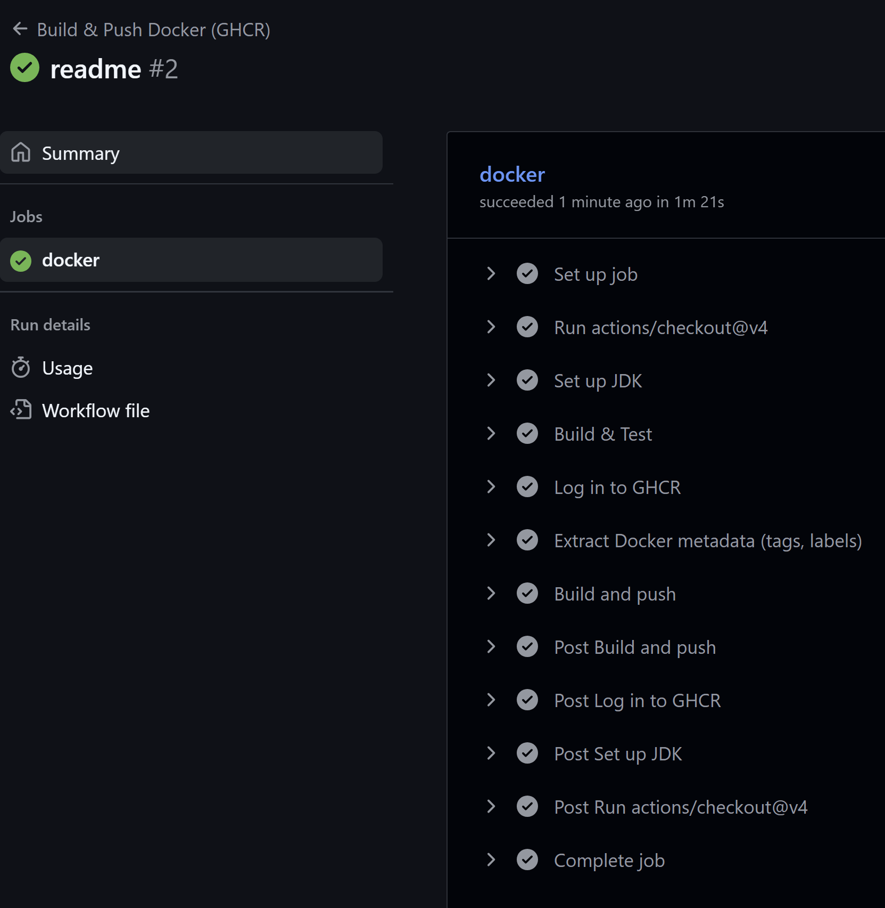
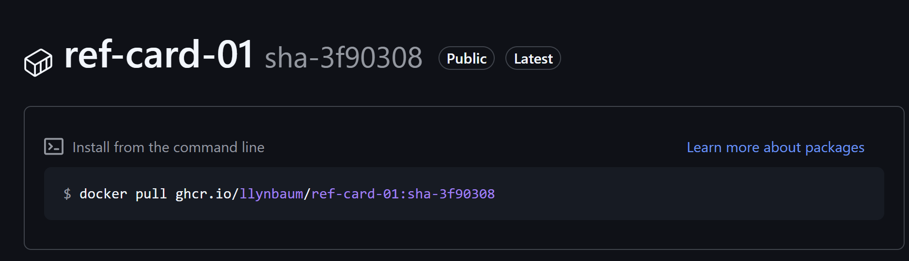

# Vorgehen

## Dockerfile erstellen

Multistage Dockerfile machen, welches das Java Project builded und ein Dockerimage erstellt.
Multistage, damit nicht der ganze Sourcecode im Image drin ist, brauchen nur die jar Datei.

## GitHub Action erstellen

1. Checkout vom Repo
2. JDK Aufsetzten um die Tests zu runnen
3. Run Test mit Maeven befehl
4. In die GitHub Registry einloggen
5. Docker metadata
    - Image name festlegen
    - Registry auf `ghcr.io` setzten (im Image Name)
6. Build Docker Image und resultat zur Registry Pushen
    - Das Dockerfile angeben, welches das Java Project builded

Wen die Action gelaufen ist:

[GitHub Action Run](https://github.com/LlynBaum/School_M324_CiCd/actions/runs/18942254902/job/54083845402)

# Resultat

Das Image auf der GitHub Registry:

Das Image auf der Dockerhub Registry:

Image local pullen:

Container Running:

Website:
